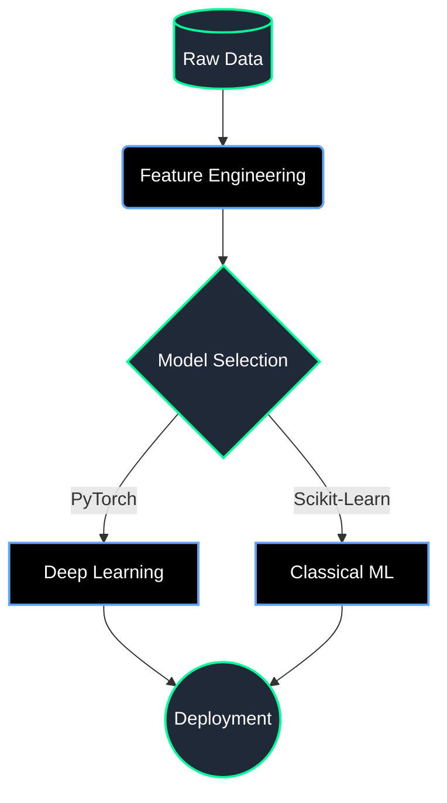

  

  

 
  

<table width="100%" align="center" style="border: none;">
  <tr>
    <td width="40%" align="center">
      
    </td>
    <td width="60%">
      <h2>🌌 <b>System Directives</b></h2>
      
<b>Designation:</b> Machine Learning Engineer & Data Analyst

      
<b>Mission:</b> Transforming complex data into scalable AI solutions.

      
<b>Current Directive:</b> Exploring advanced Deep Learning methodologies and optimizing Neural Networks.

      
<b>Status:</b> Always open to contributing to open-source AI/DS projects.

    </td>
  </tr>
</table>

  

  <h2>🧠 <b>Data Science Workflow</b></h2>

  

  <h2>⚙️ <b>Neural Architecture (Tech Stack)</b></h2>
   
    
  

  

  <h2>💬 <b>Daily Developer Quote</b></h2>
   
  

  

  <h2>🐍 <b>Contribution Heatmap</b></h2>
  <picture>
    <source media="(prefers-color-scheme: dark)" srcset="https://raw.githubusercontent.com/tanish-ml/tanish-ml/output/github-contribution-grid-snake-dark.svg">
    <source media="(prefers-color-scheme: light)" srcset="https://raw.githubusercontent.com/tanish-ml/tanish-ml/output/github-contribution-grid-snake.svg">
    
  </picture>

  

  <h2>📡 <b>Establish Uplink</b></h2>
   
  
  
  

 

  

