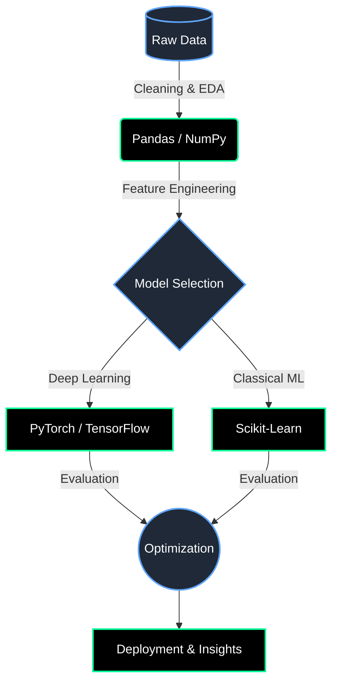

  

---

### 🖥️ Terminal Output: `cat profile.txt`

> **Designation:** Machine Learning Engineer & Data Analyst
> **Mission:** Transforming complex data into scalable AI solutions.
> **Current Directive:** Exploring advanced Deep Learning methodologies and optimizing Neural Networks.
> **Collaboration:** Always open to contributing to open-source AI/DS projects.

<!-- JOKE:START -->
> **System Log:** A SQL query goes into a bar, walks up to two tables and asks... "Can I join you?"
<!-- JOKE:END -->

---

### 🌌 Daily Cosmos Data (NASA API)
*Live tracking of astronomical imagery. Updated daily...*
<!-- APOD:START -->

  

<!-- APOD:END -->

---

### 🧠 My Data Science Workflow

---

### ⚙️ Technology Stack

  

---

### 🟩 3D Isometric Contribution Grid

  <picture>
    
  </picture>

---

### 🐍 GitHub Contribution Snake

  <picture>
    <source media="(prefers-color-scheme: dark)" srcset="https://raw.githubusercontent.com/tanish-ml/tanish-ml/output/github-contribution-grid-snake-dark.svg">
    <source media="(prefers-color-scheme: light)" srcset="https://raw.githubusercontent.com/tanish-ml/tanish-ml/output/github-contribution-grid-snake.svg">
    
  </picture>

---

### 🔌 Establish Connection

  
  

